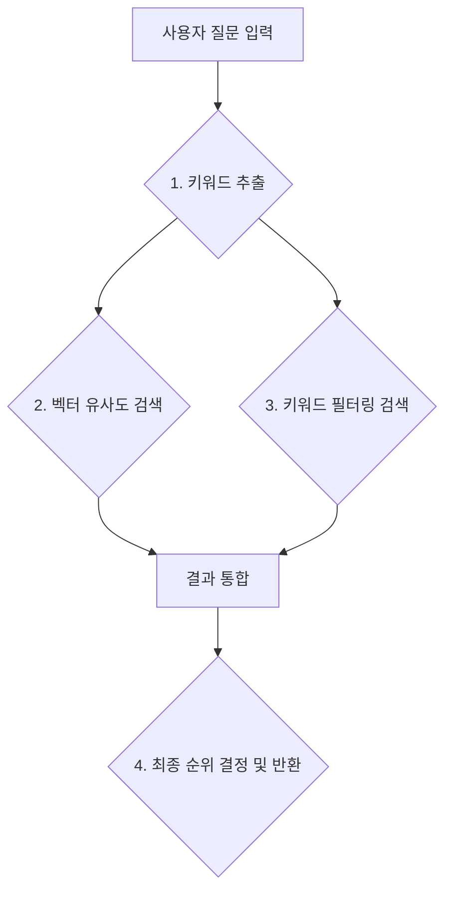

# 하이브리드 검색 (Hybrid Search) 동작 원리

본 문서는 우리 시스템의 RAG(검색 증강 생성) 서비스가 사용자의 질문에 대해 어떻게 더 정확하고 관련성 높은 정보를 찾아내는지, 그 핵심인 **하이브리드 검색(Hybrid Search)**의 동작 원리를 설명합니다.

---

## 1. 하이브리드 검색이란?

하이브리드 검색은 두 가지 이상의 검색 기술을 결합하여 각각의 장점은 취하고 단점은 보완하는 고급 검색 방식입니다.

우리 시스템은 아래 두 가지 방식을 결합하여 사용합니다.

-   **벡터 유사도 검색 (Vector Similarity Search)**: 문장의 **의미**와 **문맥**을 이해하여 관련성 높은 문서를 찾습니다. (예: "야근 식사비"와 "잔업 식대"를 같은 의미로 파악)
-   **키워드 검색 (Keyword Search)**: 사용자가 입력한 **정확한 단어**가 포함된 문서를 찾습니다. (예: "잔업"이라는 단어가 반드시 포함된 문서 검색)

이 두 가지를 함께 사용함으로써, 단순히 단어가 일치하는 문서를 넘어 사용자의 "의도"에 가장 부합하는 결과를 찾아낼 수 있습니다.

---

## 2. 하이브리드 검색의 단계별 프로세스

사용자가 질문을 입력하면, 시스템 내부는 아래와 같은 4단계를 거쳐 최적의 검색 결과를 도출합니다.

### 1단계: 키워드 추출 (Keyword Extraction)

-   먼저, 한국어 형태소 분석기(`Okt`)를 사용해 사용자의 질문에서 핵심 **명사(키워드)**를 추출합니다.
-   **예시**: "VRB 사업대상은 어떻게 돼?" → `['사업', '대상']` 추출

### 2단계: 벡터 유사도 검색 (의미 중심)

-   사용자의 질문 문장 전체를 **임베딩 모델**을 통해 수학적인 **벡터(Vector)**로 변환합니다.
-   이 벡터와 데이터베이스에 저장된 모든 문서 벡터 간의 '의미적 거리'를 계산하여 가장 유사한 문서들을 1차로 선별합니다.

### 3단계: 키워드 필터링 및 점수 보정 (정확도 향상)

-   1단계에서 추출한 키워드(`['사업', '대상']`)를 사용하여 **필터링된 검색**을 한 번 더 수행합니다.
-   이 검색은 "의미가 유사하면서, 동시에 핵심 키워드가 반드시 포함된 문서"를 찾아냅니다.
-   만약 어떤 문서가 이 조건을 만족하면, 해당 문서의 유사도 점수에 **추가 점수(Boosting Score, 예: +0.2)**를 부여하여 중요도를 높입니다.

### 4단계: 결과 통합 및 최종 순위 결정

-   2단계와 3단계에서 얻은 모든 검색 결과를 하나로 합칩니다.
-   3단계에서 추가 점수를 받은 문서들은 자연스럽게 순위가 올라갑니다.
-   최종적으로 합산된 점수를 기준으로 가장 높은 점수를 받은 순서대로 결과를 정렬하여 반환합니다.

---

## 3. 기대 효과

이러한 하이브리드 검색 방식을 통해 우리 챗봇은 다음과 같은 장점을 가집니다.

-   **높은 정확도**: 사용자의 의도를 더 깊이 이해하고, 핵심 단어를 놓치지 않아 정확한 답변을 제공합니다.
-   **유연한 검색**: 동의어, 유의어, 비정형적인 질문에도 효과적으로 대응할 수 있습니다.
-   **신뢰성 있는 결과**: 의미적으로만 유사한 애매한 결과 대신, 실제 키워드가 포함된 신뢰도 높은 문서를 우선적으로 제시합니다.
